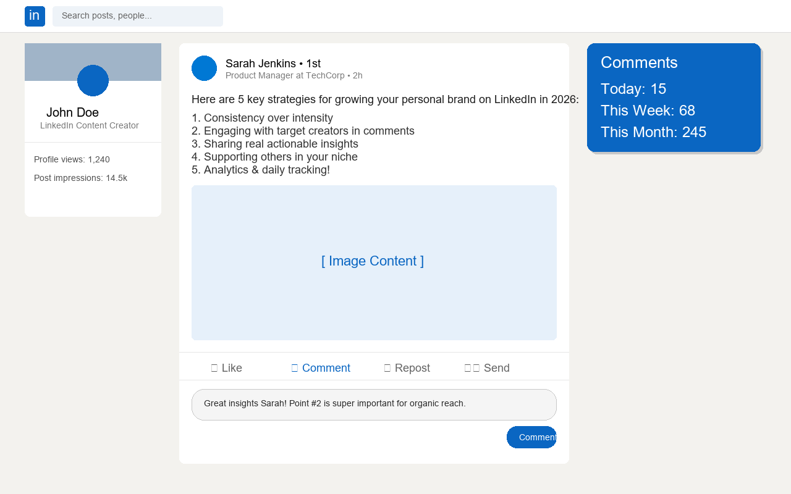

# 💬 LinkedIn Comment Counter


A lightweight, privacy-first Chrome Extension that tracks and displays how many comments you post on LinkedIn — in real-time with daily, weekly, and monthly breakdowns.

---

## 🌟 Features

- 📊 **Real-Time Tracking**: Automatically increments your comment count the instant you post a comment.
- 📅 **Daily, Weekly & Monthly Metrics**: View your activity at a glance:
  - **Today**: Reset automatically at midnight.
  - **This Week**: Track weekly outreach goals.
  - **This Month**: Monitor overall engagement consistency.
- 🎯 **Smart Button Detection**: Differentiates between opening a comment editor and actually submitting a comment to avoid false triggers.
- ⏱️ **Automatic Cycle Resets**: Zero manual effort required; reset triggers handle new days, weeks, and months seamlessly.
- 🎨 **Native LinkedIn UI Card**: Displays a sleek, non-intrusive floating card in LinkedIn's official brand blue (`#0A66C2`).
- 🔒 **100% Private & Local**: Stores all statistics locally in `chrome.storage.local`. No external servers, no tracking, and no data collection.

---

## 📸 Preview



---

## 🚀 Installation & Local Setup

### Option 1: Install via Chrome Developer Mode

1. **Clone or Download this Repository**:
   ```bash
   git clone https://github.com/your-username/linkedin-comment-counter.git
   ```
   *(Or click **Code → Download ZIP** and extract it)*.

2. **Open Extensions Page in Chrome**:
   Navigate to `chrome://extensions` in your address bar.

3. **Enable Developer Mode**:
   Toggle the **Developer mode** switch in the top-right corner.

4. **Load Unpacked Extension**:
   Click **Load unpacked** and select the repository folder containing `manifest.json`.

5. **Start Using**:
   Open [LinkedIn](https://www.linkedin.com) and the floating counter widget will appear on the top-right of your feed!

---

## 📁 Repository Structure

```text
countin-extention-main/
├── manifest.json       # Manifest V3 extension configuration
├── content.js          # DOM observer & smart comment click detection
├── background.js       # Service worker handling storage & reset cycles
├── styles.css          # Floating widget styling (LinkedIn theme)
├── icons/              # 16x16, 48x48, 128x128 extension icons
└── store_assets/       # Chrome Web Store graphics & screenshots
```

---

## 🔒 Privacy Policy

LinkedIn Comment Counter does **NOT** collect, transmit, store, or share any personal information or browsing data. All stats are kept strictly inside your local browser storage (`chrome.storage.local`).

---

## 📜 License

This project is licensed under the [MIT License](LICENSE).
